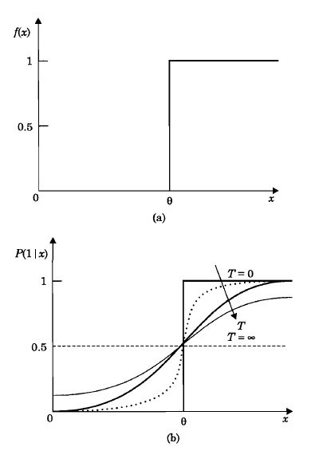
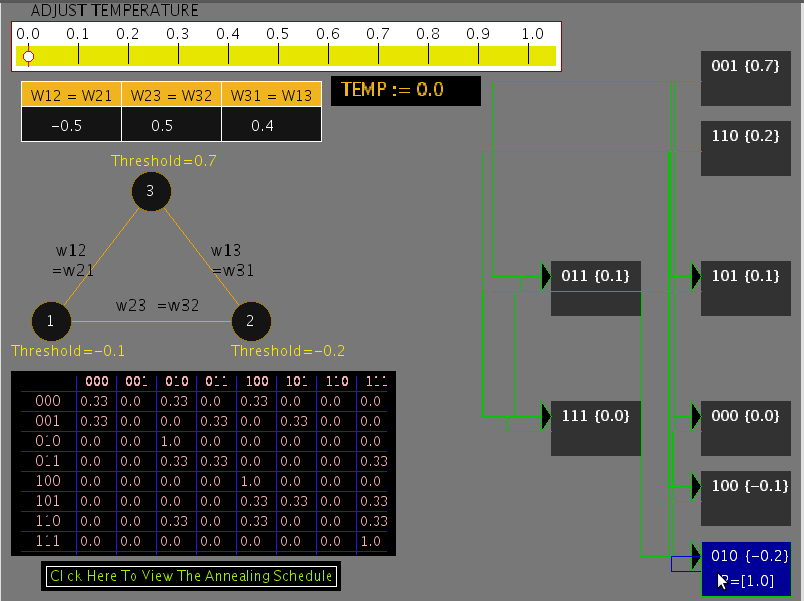
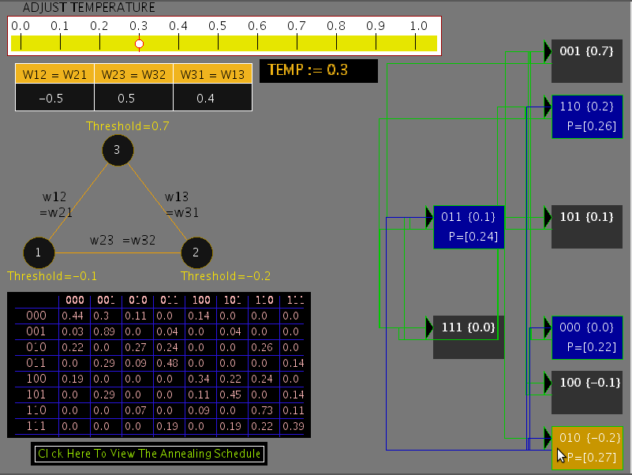
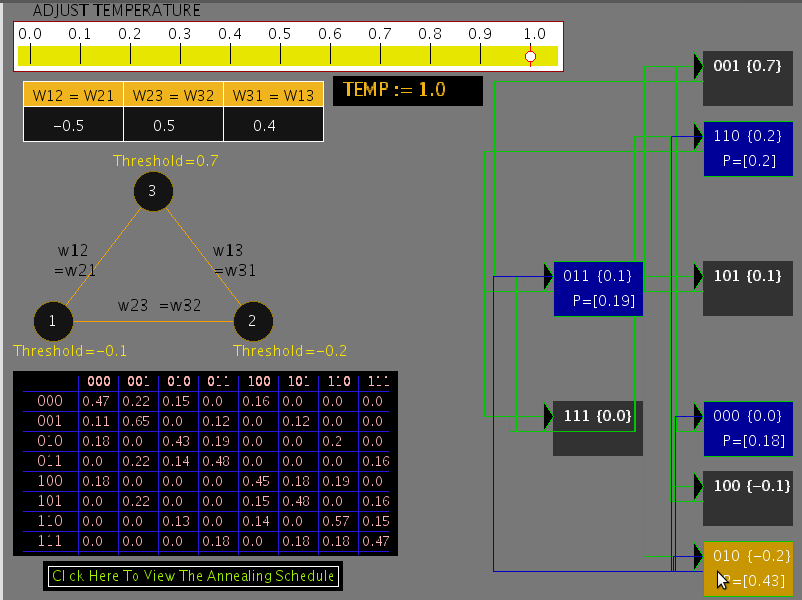
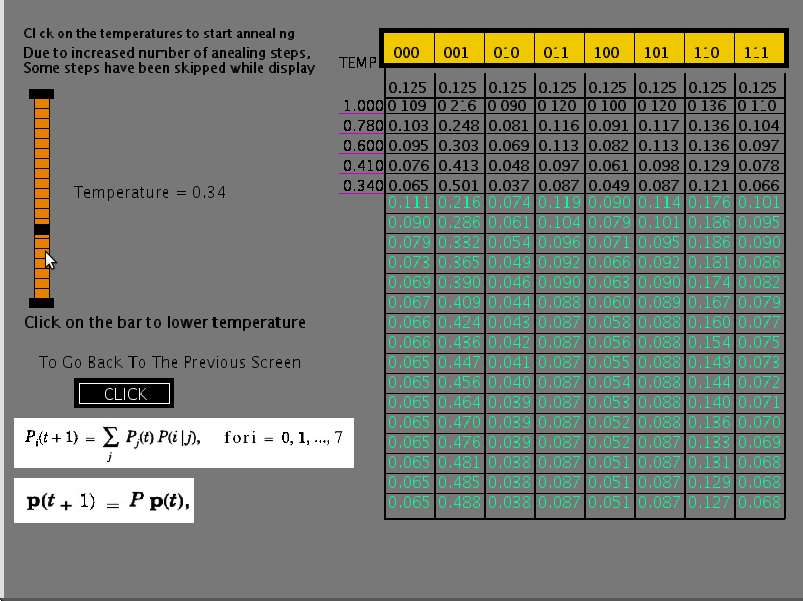
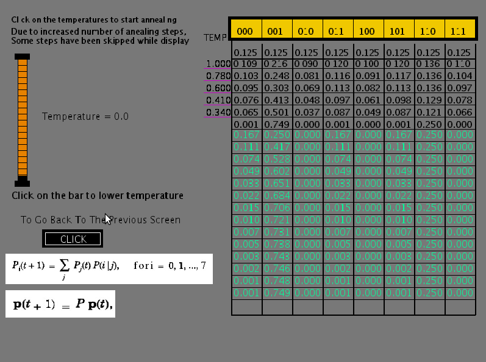

#### Problem of false minima

It is possible to design (determine a set of weights) a Hopfield model with energy minima at desired states of the model, which correspond to stable states of the network, provided these states are representable in the network.
But for a given set of weights, there may be more than the desired number of stable states (energy minima). Some of them correspond to desired patterns and the rest of the stable states correspond to false minima in the energy landscape. The presence of such additional stable states may result in recalling a pattern not present in the set of desired patterns.

The errors in recall due to the false minima can be reduced by the following methods:

- Designing the minima in such a way that the given patterns correspond to the lowest energy minima in the energy landscape of the network.
- Using probabilistic (stochastic) update for the state for each unit, instead of the deterministic update of the states of the units as dictated by the activation value and the ouput function.

#### Stochastic Update

Error in pattern recall due to the presence of false minima can be reduced significantly using suitable activation dynamics. Let us assume that we are able to determine weights in such a way that the desired patterns are stored at the lowest energy minima. The activation dynamics can be modified so that initially the network can move even to a state with higher energy from the current state, and then settle down to a nearest deep energy minimum. Its possible to realize a transition to a higher energy state from the lower energy state using stochastic update for each unit, instead of the deterministic update of the output function in the Hopfield Model. In the stochastic update model, the transition from one state to another, is expressed in probabilistic terms, i.e., probability of firing is greater than 0.5, if activation value exceeds the threshold and the probability of firing is less than 0.5, if the activation value is below the threshold value.

The output function is still a nonlinear function, either hard limiting or a sigmoid semilinear function.

We can see that the probability function depends on a parameter called temperature (T). For T=0, the update is actually deterministic. But as the temperature is increased, the probability of firing increases rapidly when the activation value exceeds the threshold.

**Figure 1**: *shows the probability function and the output function of a given unit.*

**Figure 1**: *Illustration of output function \( f(x) \) and probability of firing function \( p(1/x) \) for state update.

### Illustration of stochastic update of Hopfield model and probabilistic transitions

For the illustration, let us consider a three unit Hopfield model. At temperature T=0, the state update reduces to deterministic case. But as with increase in the temperature parameter value, the activation dynamics become stochastic in nature. The probability of firing keeps changing with change in the temperature according to the given probability function. For nonzero values of the temperature, there is a tendency to jump to states having higher energy values. As T approaches infinity, the state update no longer depends on the activation values, and hence \( \Delta V \le 0\) is no longer true, where V is the energy.

The following diagram (Figure 1) illustrates the behaviour of the state 010 at T=0 temperature.

**Figure 1**: *State transition diagram for T = 0*

If the temperature is increased to T = 0.3, the state transition diagram is as shown in the Figure 2. It can be seen that there is nonzero probability of transition from a given state to a state having higher energy.

**Figure 2**: *State transition diagram for T = 0.3*

The probability of transition to higher energy state increases as the value of the temperature parameter is increased further, as shown in Figure 3 for T = 1.0 .

**Figure 3**: *State transition diagram for T = 1.0*

#### Simulated Annealing

For the 3-unit network, the stationary probability distribution of states for a given temperature is obtained using the equation

\( p_{i}(t+1) = \sum\limits_{j}p_{j}(t)p(i/j), ~ for ~ i = 0,1,2, ..., 7 \)

where \( p_{i}(t) \) is the probability of the state \(i\) at time t and \( p(i/j) \) is the transition probability from state \(j\) to state \(i\) for a given temperature. Starting with equal probabilities for all the states \( p_{i}(0) = \frac{1}{8}, ~ i = 0,1, ..., 7,~ \) the above equation converges to stationary probability distribution after a few iterations. At that stage, the value of T is decreased according to some annealing schedule, until the value of T is close to zero. The resulting state transition probabilities for different iterations and at different temperatures of the annealing schedule can be seen in the table in second part of experiment. Note that at T = 0, there are only a few states which have nonzero probabilities and all other states have zero probability. The distribution of the nonzero probabilities are inversely related to the energy of those states according to Boltzmann-Gibb's law. The table illustrates the principle of simulated annealing for overwriting the effects of false minima. It is important to note that while performing the annealing of the network, we always slowly lower the temperature.

**Figure 4**: *Initial state of annealing schedule at temperature T = 1.0*

**Figure 5**: *State of annealing schedules after running through for a couple of temperature values.*

**Figure 6**: *Final annealing state for T = 0*